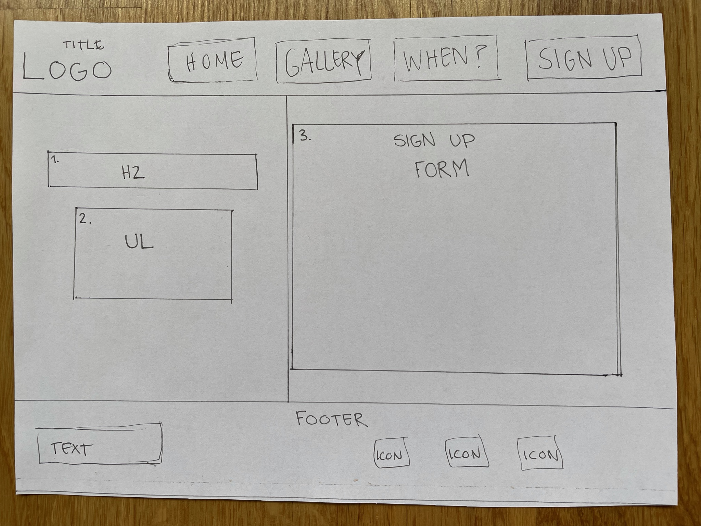

# Arts in Älta

Artsalta is a website for anyone interested and/or looking for an arts club located in Älta. This website is created to reach out and give users information about the club. 
The information provided by the page will tell the user all they need to know about what the club does, when they meet up, where they are located, how to sign up to join and contact the club. The Website also provides information that shows the user some of the work done by members through a gallery page with images from the event. 

Will add amiresponsive image here 

## UX 
The design of the website is minimalistic with a twist of colors to create a fun and energy giving experience to the user. The design should lead the user through the website and make it easy for them to navigate

### Colour Scheme 
The colours chosen for the website are orange, blue and a very light grey. I choose orange and blue because they are complimentary colours, which create a good contrast to each other.

### Typography 
To keep the design of the website minimalistic with a fun twist I used a clean simple font for the overall text on the website, and for the Headings a more playful font. I importet two fonts from Google fonts: 
* Monserrat 
* Molle 

The social icons in the footer are imported from Font-awesome, they fonts used are: 
* Facebook
* Instagram 
* Spotify 

### Wireframes 
Here are my wireframes for the project. 

## Features

### Existing Features
* Header
  * The header is featured at the top of the page and has the navigation nested inside it.
  * The header shows the name of the club and the websites navigation menu. It uses the chosen google fonts and colours for the website.

* Navigation 
  * The navigation is featured inside the header at the top of the page, which shows the most important sections of the website.
  * To the left is a link that is connected to the clubs logo ”Arts in Älta”, and links to the top of the homepage.
  * To the right are the other four navigation links. These are: Home, Gallery, When and Sign-up. The Gallery and Sign-up link will take the user to a separate page of the website. The Home link will take the user to the same page as the logo ”Arts in Älta does, while the When link will take the user to the When section on the Home page.
  * The navigation links to the right, creates a simple menu that clearly tells the user where they will be directed when clicked on. They have an easy to read font and each link are surrounded by a border to make it more visibly for the user.

* About Section 
  * The About section gives the user details about what kind of club “arts in Älta” is and what they offer as a member.
  * This section gives the user information about what the club offers in a list element.

* Quote Section 
  * The Quote section is featured to give the page a break from the structure. 
  * It gives the user a slogan and/or short text that describes the club.

* When Section 
  * The When section gives the user clear information about most important to know about each meeting, like which day they meet, at what time and if there is any additional information that is good to know. 
  * The information in this section is shown in a table to make it easier for the user to read the information. 

* Where Section 
  * The Where section gives the user information on where the club is located through text and a map. 
  * The map is an embedded google maps map, that make sit easy for the user locate the club and see if there is any parking or public transportation to the location.

* The Footer section 
  * The Footer section is featured at the bottom of every page on the website.
  * The Footer section includes social media icons, with links to each platform, to the left. It also includes a text that gives the user information about how to contact the club if needed. 

* The Gallery Page 
  * The Gallery page features a total of 7 pictures and a heading with information about the page. 
  * The Gallery page gives the user visual information about what the members of the club has produced and what a member can do and/or learn at the club.
  
* The Sign up Page
  * The Sign up page gives the user information about the membership through a list and then the opportunity to sign up as a member. 
  * The form collects the name, phone number and email address to the person who is signing up as a member. 
  * The sign up form gives the user accessibility and an easy way to sign up as a member.

### Features Left to Implement

## Technologies Used

## Testing

### Browser Compatibility

### Code Validation

### REsponsiveness

### Unfixed Bugs 

## Deployment

### Local Deployment 

## Credits 

### Content 

### Media