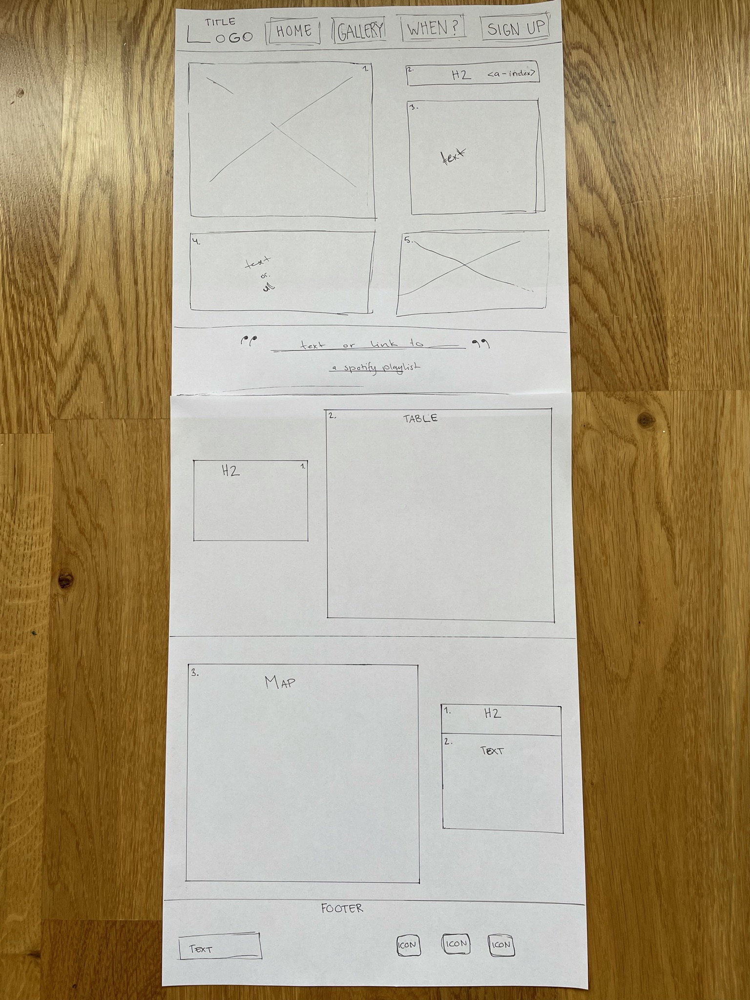
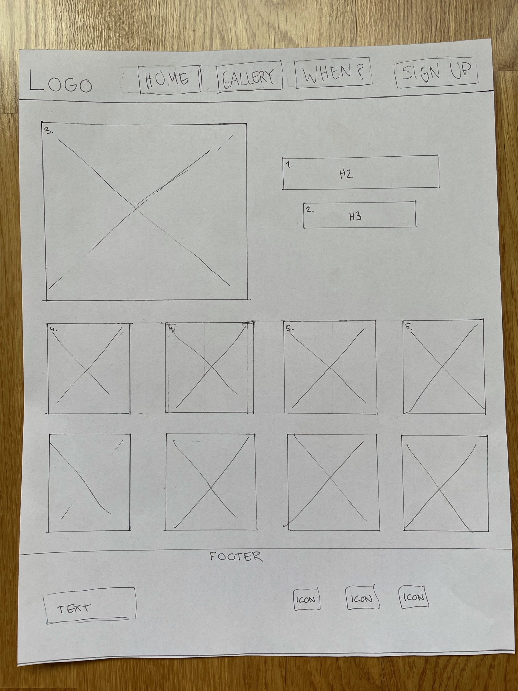
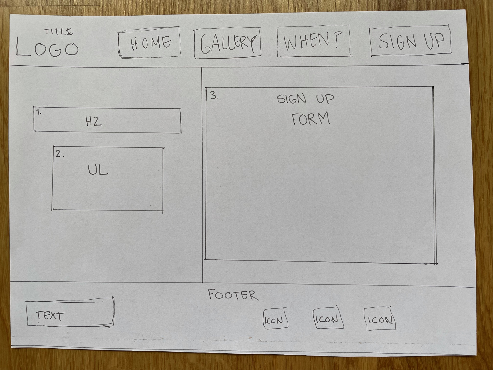

# Arts in Älta

Artsalta is a website for anyone interested and/or looking for an arts club located in Älta. This website is created to reach out and give users information about the club. 
The information provided by the page will tell the user all they need to know about what the club does, when they meet up, where they are located, how to sign up to join and contact the club. The Website also provides information that shows the user some of the work done by members through a gallery page with images from the event. 

Will add amiresponsive image here 

## User Stories

* "I want to easily navigate through the website"
* "I want a simple and easy sign up form with relevent infromation"
* "I want to be able to read the whole site on my phone and/or tablet" 
* "I want clear information about time, meetings and where the club is located" 
* "I want links to relevent social media platforms" 
* "I want to see picture of work done by other members"

## UX 

The design of the website is minimalistic with a warm colours to create a sofisticated website that is clean and have focus on the shared and relevant information to the user. The design should lead the user through the website and make it easy for them to navigate.

### Colour Scheme 

The colours chosen for the website are a burgndy-red #5c0b1d, a warm pink #b26f6c and a light pink #fff7f3 as background colour. I choese these because the go well with each other and make a good contrast when put togehter.

### Typography 

To keep the design of the website minimalistic with a fun twist I used a clean simple font for the overall text on the website, and for the Headings a more playful font. I importet two fonts from Google fonts: 
* [Monserrat](https://fonts.google.com/specimen/Montserrat?query=mon)
* [Molle](https://fonts.google.com/specimen/Molle?query=moll)

The social icons in the footer are imported from Fontawesome, they fonts used are: 
* [Facebook](https://fontawesome.com/v5.15/icons/facebook-square?style=brands)
* [Instagram](https://fontawesome.com/v5.15/icons/instagram?style=brands)
* [Spotify](https://fontawesome.com/v5.15/icons/spotify?style=brands)

### Wireframes 

Here are my wireframes for the project. 

## Features

### Existing Features

* Header
  * The header is featured at the top of the page and has the navigation nested inside it.
  * The header shows the name of the club and the websites navigation menu. It uses the chosen google fonts and colours for the website.

* Navigation 
  * The navigation is featured inside the header at the top of the page, which shows the most important sections of the website.
  * To the left is a link that is connected to the clubs logo ”Arts in Älta”, and links to the top of the homepage.
  * To the right are the other four navigation links. These are: Home, Gallery, When and Sign-up. The Gallery and Sign-up link will take the user to a separate page of the website. The Home link will take the user to the same page as the logo ”Arts in Älta does, while the When link will take the user to the When section on the Home page.
  * The navigation links to the right, creates a simple menu that clearly tells the user where they will be directed when clicked on. They have an easy to read font and each link are surrounded by a border to make it more visibly for the user.

* About Section 
  * The About section gives the user details about what kind of club “arts in Älta” is and what they offer as a member.
  * This section gives the user information about what the club offers in a list element.

* Quote Section 
  * The Quote section is featured to give the page a break from the structure. 
  * It gives the user a slogan and/or short text that describes the club.

* When Section 
  * The When section gives the user clear information about most important to know about each meeting, like which day they meet, at what time and if there is any additional information that is good to know. 
  * The information in this section is shown in a table to make it easier for the user to read the information. 

* Where Section 
  * The Where section gives the user information on where the club is located through text and a map. 
  * The map is an embedded google maps map, that make sit easy for the user locate the club and see if there is any parking or public transportation to the location.

* The Footer section 
  * The Footer section is featured at the bottom of every page on the website.
  * The Footer section includes social media icons, with links to each platform, to the left. It also includes a text that gives the user information about how to contact the club if needed. 

* The Gallery Page 
  * The Gallery page features a total of 7 pictures and a heading with information about the page. 
  * The Gallery page gives the user visual information about what the members of the club has produced and what a member can do and/or learn at the club.
  
* The Sign up Page
  * The Sign up page gives the user information about the membership through a list and then the opportunity to sign up as a member. 
  * The form collects the name, phone number and email address to the person who is signing up as a member. 
  * The sign up form gives the user accessibility and an easy way to sign up as a member.

### Features Left to Implement

* Add a section with a news board, like blog post or forum
* Creat a gallery with gallery album, so when selecting an album it opens to a new page displaying all images in that album.

## Technologies Used

For this project I have used the following technologies 
* HTML
* CSS 
* GitHub 
* GitPod 
* Dev Tools 
* Unicorn Revealer 
* Auto Prefixer 

## Testing

### Browser Compatibility

* Chrome 

* Safari 

* Firefox

### Code Validation

* HTML
 * The code has one warning, which is that the Quote section lacks a h-element, when passing through the offical [WC3-validator](https://validator.w3.org/nu/?doc=https%3A%2F%2Fstroemlind.github.io%2Fartsinalta%2Findex.html)

* CSS
 * No errors where found when passing through the offical [(Jigsaw)-validator](https://jigsaw.w3.org/css-validator/validator?uri=https%3A%2F%2Fvalidator.w3.org%2Fnu%2F%3Fdoc%3Dhttps%253A%252F%252Fcode-institute-org.github.io%252Flove-running-2.0%252Findex.html&profile=css3svg&usermedium=all&warning=1&vextwarning=&lang=en#css)

### Responsiveness

### Tested User Stories

### Unfixed Bugs 

* The chosen fonts do not work in safari
* I am aware of the warning from the HTML Validator 

## Deployment

The site was deployed to GitHub pages. The steps to deploy are as follows:

- In the GitHub [repository](https://github.com/stroemlind/artsinalta), navigate to the Settings tab.
- From the source section drop-down menu, select the `Main` Branch.
- Once the Main branch has been selected and saved, the page will be automatically refreshed with a detailed ribbon displayed to indicate the successful deployment.

The live link can be found here - https://stroemlind.github.io/artsinalta

### Local Deployment 

In order to make a local copy of this project, you can type the following into your IDE Terminal to clone this repository:

- `git clone https://github.com/stroemlind/artsinalta.git`

Alternatively, if using Gitpod, you can [click here](https://gitpod.io/#https://github.com/stroemlind/artsinalta), and it will create a brand new workspace on your own Gitpod account.

## Credits 

### Content 

* All the information and text given are ficional and made up by the developer for sole purpose to this project.
* The fonts for the website are taken from [Google-fonts](https://fonts.google.com/)
* The icons in the footer are taken from [Fontawesome](https://fontawesome.com/)
* Information and instruction about the favicon was given by my mentor Tim Nelson
* The instruction for the placeholder pattern for phone number in the Sign Up form was taken from [w3school](https://www.w3schools.com/html/html_form_input_types.asp)
* To get the structure of the gallery on the Gallery page right, I got help from Code Institute tutor Ed and through this [article](https://developer.mozilla.org/en-US/docs/Web/CSS/grid-template-columns)
* For my code with Media Queries I looked at the project "Love Running"
* Used [Autoprefixer](https://autoprefixer.github.io/) for my CSS code

### Media

* The photo on the index page is taken from [pexels](https://www.pexels.com/sv-se/foto/konst-kreativ-hand-borste-4309872/)
* The photos for the gallery page are all taken from pexel, link to each below: 
 * [Img-1](https://www.pexels.com/sv-se/foto/man-karlek-manniskor-kvinna-3817580/)
 * [Img-2](https://www.pexels.com/sv-se/foto/malning-abstrakt-brun-komposition-5501874/)
 * [Img-3](https://www.pexels.com/sv-se/foto/gryning-man-karlek-manniskor-3817499/)
 * [Img-4](https://www.pexels.com/sv-se/foto/kvinna-konst-kreativ-malning-3817657/)
 * [Img-5](https://www.pexels.com/sv-se/foto/gryning-mode-man-manniskor-3819792/)
 * [Img-6](https://www.pexels.com/sv-se/foto/mode-man-manniskor-kvinna-3819794/)
 * [Img-7](https://www.pexels.com/sv-se/foto/person-hander-konst-kreativ-4483093/)
* The map for the where section is from [google maps](https://www.google.se/maps/place/Oxelv%C3%A4gen+42,+138+30+%C3%84lta/@59.2563055,18.1743694,17z/data=!3m1!4b1!4m5!3m4!1s0x465f7923c226d0db:0x7013aa4e4516b29!8m2!3d59.2563028!4d18.1765582)
* The favicon is taken from [pexels](https://www.pexels.com/sv-se/foto/design-farg-ljus-utrustning-2303796/)