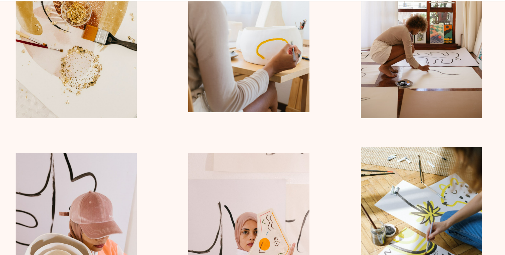
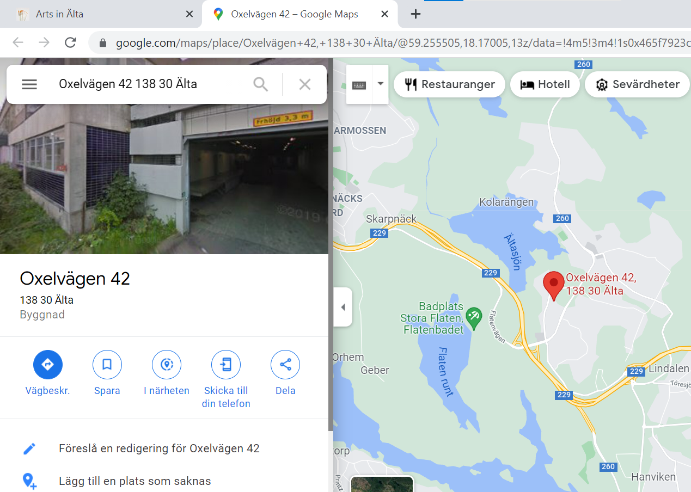
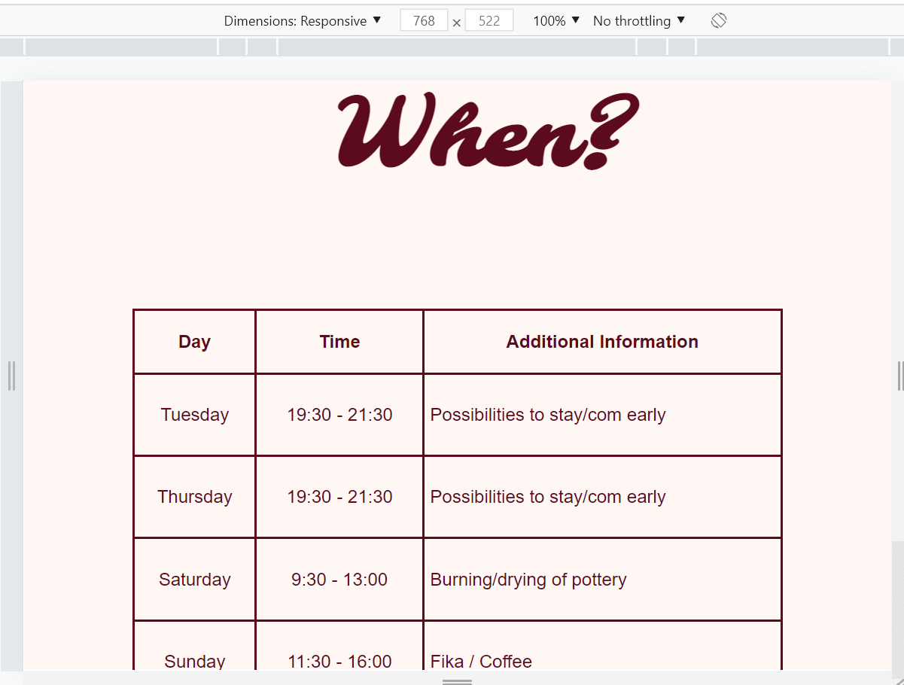
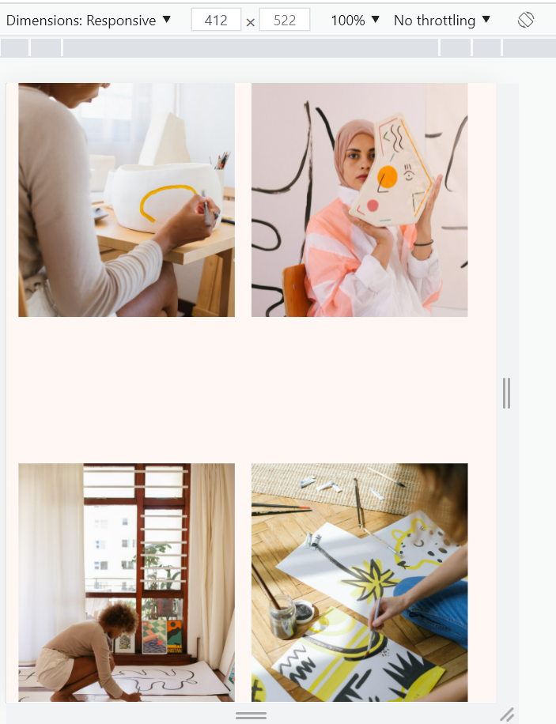

# Arts in Älta

Arts in Älta is a website for anyone interested in or looking for an art club located in Älta. The Website was created to reach out and give users information about the club. 
The information provided by the page will tell the user all they need to know about what the club does, when they meet up, where they are located, how to sign up to become a member, and how to contact the club. The Website also provides information to show the users some of the work done by members through a gallery page. 

When creating and developing the design for the Website, these User Stories was taken under consideration:

### User Stories
* "I want to navigate through the Website easily."
* "I want a simple and easy sign-up form with relevant information."
* "I want to be able to read the whole site on my phone and or tablet." 
* "I want clear information about time, meetings, and where the club can be found." 
* "I want links to relevant social media platforms." 
* "I want to see pictures of work done by other members."

## UX 

The design of the Website is minimalistic with warm colors to create a sophisticated website that is clean and has a focus on the shared and relevant information to the user. The design should lead the user through the Website and make it easy for them to navigate. The design is based on the given User Stories and the goals that Arts in Älta have by launching a website.

### Layout 

The layout has a flow of sections on top of each other. The sections are divided into two divisions next to each other. The only exceptions are the Quote Section and the Gallery Section, which consist of one area only. This layout makes it easy for the user to view the content and understand the content on each section.
When viewed on a smaller device, the division gets a vertical layout to make it easier for the viewer to read the content on the screen. See Wireframe Section for pictures of the layout idea.

### Color Scheme 

The colors chosen for the website are a burgundy-red #5c0b1d, a warm pink #b26f6c and a light pink #fff7f3 as the background color. I chose these because they go well with each other and make a good contrast when put together.
I used the [ColoSpace](https://mycolor.space/) Website to find the correct hex value and matching colors.

### Typography 

To keep the Website's design minimalistic with a fun twist, I used a clean, simple font for the overall text on the Website. For the Headings, I chose a more playful font. I imported the two fonts from Google fonts: 
* [Monserrat](https://fonts.google.com/specimen/Montserrat?query=mon)
* [Molle](https://fonts.google.com/specimen/Molle?query=moll)

The social icons in the footer were imported from Fontawesome. The fonts used are: 
* [Facebook](https://fontawesome.com/v5.15/icons/facebook-square?style=brands)
* [Instagram](https://fontawesome.com/v5.15/icons/instagram?style=brands)
* [Spotify](https://fontawesome.com/v5.15/icons/spotify?style=brands)

### Wireframes 

These are the drawn wireframes for the project: 

## Features

### Existing Features

* Header
  * The header is featured at the top of the page and has the navigation nested inside it.
  * The header shows the name of the club and the Website’s navigation menu. It uses the chosen google fonts and colors for the Website.

* Navigation
  * The navigation menu is featured inside the header at the top of the page, which shows the most important sections of the Website.
  * To the left is a link with the club's logo, ”Arts in Älta”, and links to the top of the homepage.
  * To the right are the other four navigation links. These are Home, Gallery, When, and Sign-up. The Gallery and Sign-up link will take the user to a separate page of the Website. The Home link will take the user to the same page as the logo Arts in Älta does, while the When link will take the user to the When section on the Home page.
  * The navigation links create a simple menu that tells the user where they will be direct when selected. They have an easy-to-read font, and a border surrounds each link to make it more visible for the user.

  

* About Section 
  * The About Section gives the user details about what kind of club “arts in Älta” is and what they offer as a member.
  * This Section gives the user information about what the club offers in a list element.

  

* Quote Section 
  * The Quote section is featured to give the page a break from the structure. 
  * It gives the user a slogan that describes the club's motto.

  

* When Section 
  * The When Section gives the user precise information about the most important to know about each meeting, like which day they meet, at what time, and any additional information that is good to know. 
  * The information is shown in a table to make it easier for the users to read the information. 

  

* Where Section 
  * The Where section gives the user information on the club's location through text and a map. 
  * The map is an embedded google maps map that makes it easy for the user to locate the club and see possible parking options or public transportation to the location.

  

* The Footer section 
  * The Footer section is featured at the bottom of every page on the website.
  * The Footer section includes social media icons, with links to each platform, to the left. It also includes a text that gives the user information about how to contact the club if needed. 

  

* The Gallery Page 
  * The Gallery page features a total of 7 pictures and a heading with information about the page. 
  * The Gallery page gives the user visual information about what the club members have produced and what a member can do and learn.

   
  
* The Sign-up Page
  * The Sign-up page gives the user information about the membership through a list and then the opportunity to sign up as a member. 
  * The form collects the name, phone number, and email address of the person signing up as a member. 
  * The sign-up form gives the user accessibility and an easy way to sign up as a member.

  

### Features Left to Implement

Here are some features that would be great to implement in the future to keep the website updated to the user:
* Add a section with a news board, like blog post or forum
* Create a gallery with gallery albums, so when selecting an album, it opens to a new page displaying all images in that album.

## Technologies Used

The technologies used to develop this project are following: 
 
* HTML: HTML5 was used to create the core structure of the website.

* CSS: CSS was used to style all the pages on the website.
 
* GitHub: GitHub was used to store my repository and GitHub Pages to deploy the website. 

* Gitpod: GitPod was used as the development environment for developing my code during this project.

* Git: Git was used to ensuring that the project would have backups and all the versions pushed to GitHub during the development of this project.

* Dev Tools: Dev Tools was used to look over the development of the website and try different approaches to problems that would occur during the process. 

* Unicorn Revealer: Unicorn Revealer was used to find bugs, especially during the process of making the website responsive.

* Auto Prefixer: This was used at the end of the project to give my CSS code some extra properties when used on different browsers.  

## Testing
Testing done for the Website was done both manually and automatically. 

For manual testing, I always had a tab open with the preview of the Website. To check up on my code and see if it worked as I wanted. During the Website development, I used Dev Tools to see how the code would respond if I added or changed properties or values. Dev Tools were also used to check for responsiveness when decreasing or increasing the screen size. 
Another tool used during development and testing was Unicorn Revealer, which helped me see if any content was outside its container. 

To see and test the Website's performance, I used Lighthouse, which gave me an updated report to see how well my accessibility was for the Website. This tool was used, together with Dev Tools, when I needed to change and choose the color of the Website. The last test results were these: 

### Browser Compatibility

* Chrome
  * The website works well in Chrome and has full browser compatibility. The layout and all the functions that are applied to the website response as they should. All the pages load their content accordingly. 
  

* Firefox
  * The website works well in Firefox and has full browser compatibility. The layout and all the functions respond as they should. All the pages load their content accordingly. 
  

* Safari 
  * The website works well in Safari. The layout and most of the function works as they should. Safari does not seem to render the Google font ‘Molscroll attribute given to the When button in the menu, but it takes you to the given destination on the website.
  

### Code Validation
For automatically testing, the WC3 Validator and Jigsaw Validator was used.

* HTML
 * The code has no form of errors, but it has one warning, which is that the Quote section lacks a h-element when passing through the official[WC3-validator](https://validator.w3.org/nu/?doc=https%3A%2F%2Fstroemlind.github.io%2Fartsinalta%2Findex.html)
 

* CSS
 * No errors where found when passing through the offical [(Jigsaw)-validator](https://jigsaw.w3.org/css-validator/validator?uri=https%3A%2F%2Fstroemlind.github.io%2Fartsinalta%2Findex.html&profile=css3svg&usermedium=all&warning=1&vextwarning=&lang=svs)
 

### Responsiveness 

The website responds to the flow when increasing or decreasing the screen size. The content flow makes the layout and content easy to follow for the user when using different screen sizes. 
When the screen size decreases, the layout re-arranges itself to go from a layout with a row look to a layout with a column look. This makes the user experience more comfortable for the user. The content also re-size itself to fit the screen size and view. 

* #### Website viewed from a desktop screen size

  

* #### Website viewed from a tablet screen size

  

* #### Website viewed from a phone screen size 

  

### Tested User Stories

These are the result after testing the functions on the Website made by the User Stories. 

* "I want to navigate through the Website easily."
  * #### The logo in the header
   The logo on the left side of the header “Arts in Älta” is linked to the given landing page of the website. When selected, it takes the user to the top of the Home page.

    

  * The Navigation bar/ Menu 
    When the user navigates through the menu, it takes the user to the top of the assigned page. 

  * Scroll function for When in the Navigation bar
    When a user selects the When button in the menu, the index page will load first and then scroll smoothly down to the When section of the Home page. However, this application does not render well in the Safari browser or used on a mobile device. 

    

* "I want clear information about time, meetings, and where the club can be found." 
  * #### Google Maps 
    The embedded Google Map works well in all tested browsers. If selected, the user can use the commandos for zooming, get directions to the place, and open a new tab.

     
    
    

* "I want a simple and easy sign up form with relevant infromation"
  * #### The Sign Up
    The form works in all browsers. It will only submit the form if all required fields have content. If not, it will notify the user of that specific field and ask them to write in the correct information. See images below.

    
    
    

* "I want links to relevent social media platforms" 
  * #### Social Media icons links
    All three Social Media icons work well on all tested browsers. When selected, each link opens in a new tab for the content given to them.
    * Facebook: 
    

    *Instagram:
    

    *Spotify:
    

* "I want to be able to read the whole site on my phone and or tablet." 
  * For the User Story about reading the website on a phone and tablet, it is entirely durable. The User can read and navigate through the content no matter the screen size.

  * Tablet view:
  
  
  
  
  

  * Phone view: 
  
  
  
  
  
  

* "I want to see picture of work done by other members"
  * The users can see picture of other club members through the websites Galley page. 

   

### Unfixed Bugs 
There were two bugs that I was not able to fix during this project.

* The google font ‘Molle’ does not render on safari or internet apps. A solution to this could be to download the font and upload it to the repository.

* The scroll function does not work on Safari or internet mobile apps. A solution to this could be fixing the scroll element in the code with some extra values. 

* I am aware of the warning from the HTML Validator about the Quote Section.

## Deployment

The site was deployed to GitHub pages. The steps to deploy are as follows:

- In the GitHub [repository](https://github.com/stroemlind/artsinalta), navigate to the Settings tab.
- From the source section drop-down menu, select the `Main` Branch.
- Once the Main branch has been selected and saved, the page will be automatically refreshed with a detailed ribbon displayed to indicate the successful deployment.

The live link can be found here - https://stroemlind.github.io/artsinalta

### Local Deployment 

In order to make a local copy of this project, you can type the following into your IDE Terminal to clone this repository:

- `git clone https://github.com/stroemlind/artsinalta.git`

Alternatively, if using Gitpod, you can [click here](https://gitpod.io/#https://github.com/stroemlind/artsinalta), and it will create a brand new workspace on your own Gitpod account.

## Credits 

### Content 

* All the information and text given are fictional and made up by the developer for the sole purpose of this project.
* The fonts for the website are taken from [Google-fonts](https://fonts.google.com/)
* The icons in the footer are taken from [Fontawesome](https://fontawesome.com/)
* Information and instruction about the favicon was given by my mentor Tim Nelson
* The instruction for the placeholder pattern for phone number in the Sign Up form was taken from [w3school](https://www.w3schools.com/html/html_form_input_types.asp)
* To get the structure of the gallery on the Gallery page right, I got help from Code Institute tutor Ed and through this [article](https://developer.mozilla.org/en-US/docs/Web/CSS/grid-template-columns)
* For my code with Media Queries I looked at the project "Love Running"
* Used [Autoprefixer](https://autoprefixer.github.io/) for my CSS code
* Used this [Article](https://dev.to/nehalahmadkhan/how-to-make-footer-stick-to-bottom-of-web-page-3i14) to fix my footer for screens size over 992px
* I used this [css-tricks article](https://css-tricks.com/snippets/css/a-guide-to-flexbox/) for writing some of my CSS code 
* The [ColoSpace](https://mycolor.space/) Website. Used to find the colors of the Website.

### Media

* The photo on the index page is taken from [pexels](https://www.pexels.com/sv-se/foto/konst-kreativ-hand-borste-4309872/)
* The photos for the gallery page are all taken from pexel, link to each below: 
 * [Img-1](https://www.pexels.com/sv-se/foto/man-karlek-manniskor-kvinna-3817580/)
 * [Img-2](https://www.pexels.com/sv-se/foto/malning-abstrakt-brun-komposition-5501874/)
 * [Img-3](https://www.pexels.com/sv-se/foto/gryning-man-karlek-manniskor-3817499/)
 * [Img-4](https://www.pexels.com/sv-se/foto/kvinna-konst-kreativ-malning-3817657/)
 * [Img-5](https://www.pexels.com/sv-se/foto/gryning-mode-man-manniskor-3819792/)
 * [Img-6](https://www.pexels.com/sv-se/foto/mode-man-manniskor-kvinna-3819794/)
 * [Img-7](https://www.pexels.com/sv-se/foto/person-hander-konst-kreativ-4483093/)
* The map for the where section is from [google maps](https://www.google.se/maps/place/Oxelv%C3%A4gen+42,+138+30+%C3%84lta/@59.2563055,18.1743694,17z/data=!3m1!4b1!4m5!3m4!1s0x465f7923c226d0db:0x7013aa4e4516b29!8m2!3d59.2563028!4d18.1765582)
* The favicon is taken from [pexels](https://www.pexels.com/sv-se/foto/design-farg-ljus-utrustning-2303796/)

### Acknowledgements 

I want to give acknowledgments to my mentor Tim Nelson and the Code Institute Tutors Ed and Kevin. They have helped me a lot and provided great support during this project. 
Tim helped me a lot when getting started with the project. He gave me great feedback on my choice of color, how to link the navigation menu to the when section of the Website and tried his best to help me when there was a bug in my code while testing the Website's responsiveness. 
The Code Institute Tutors Kevin and Ed helped me fix the Website's structure to work as I wanted it to be. Ed gave me a great article about flex-element that helped me a lot; see content credit list.
During this project, I also looked back on the course material when I wanted to refresh my memory or got stuck on a problem. 